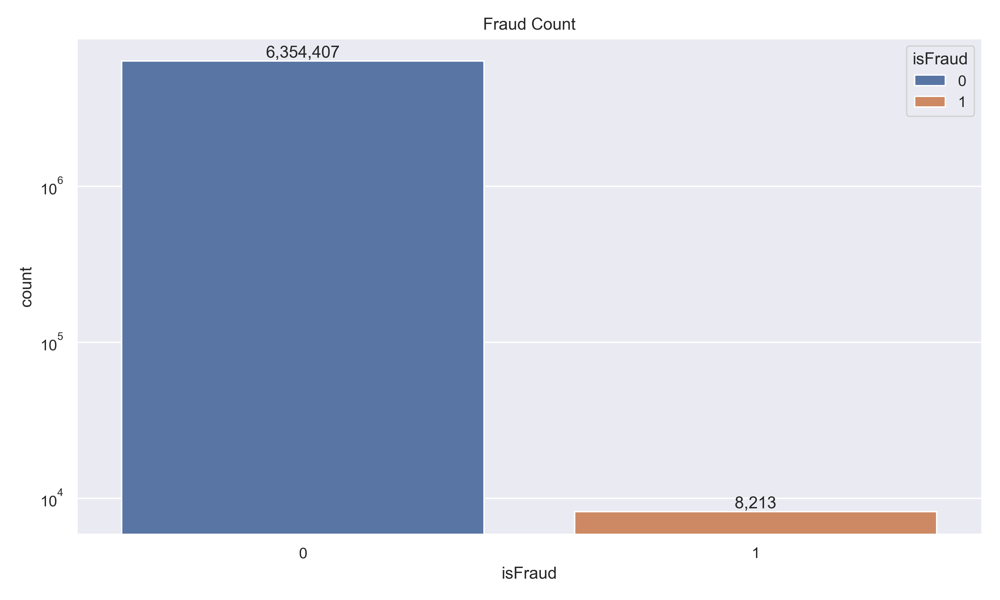
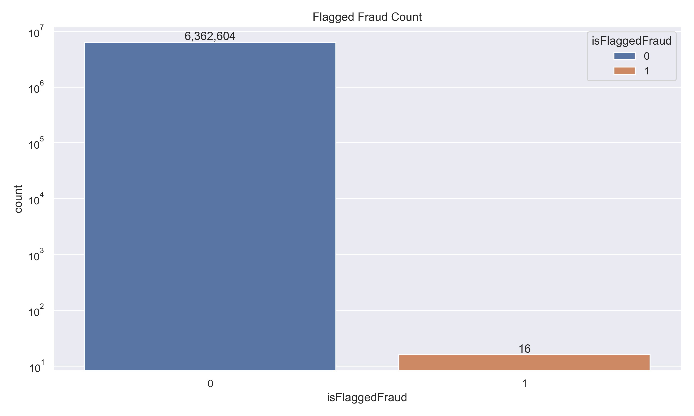
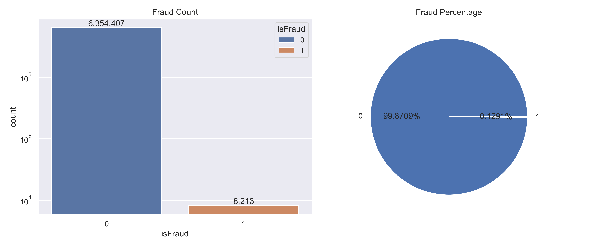
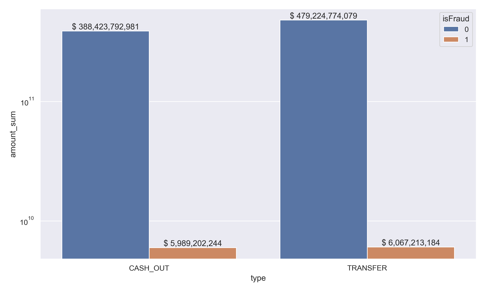
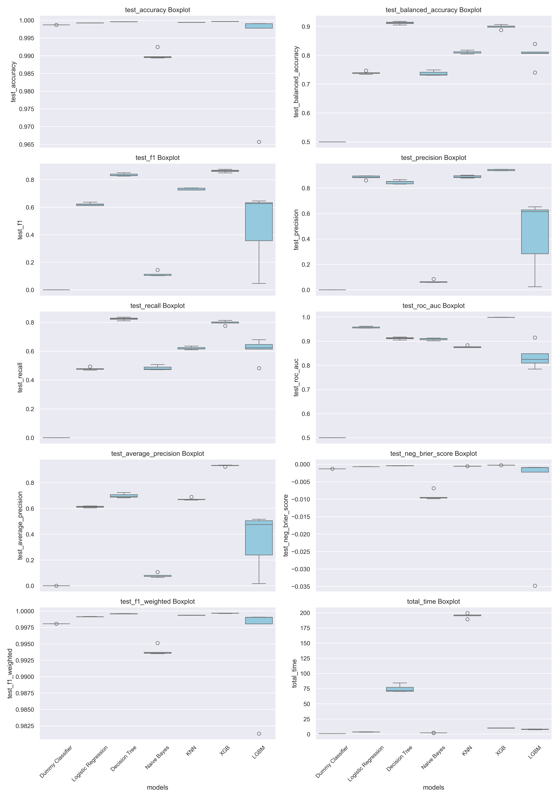

# Fraud Detection

## 1 – Project description

This project focuses on the detection of fraudulent financial transactions using synthetic data generated by the PaySim simulator. Due to the private and sensitive nature of financial data, obtaining real-world datasets for research in fraud detection is extremely challenging. PaySim addresses this issue by simulating mobile money transactions based on statistical characteristics of a real dataset obtained from a mobile money service in an African country.

By replicating the dynamics of legitimate and illegitimate user behavior through agent-based simulation, PaySim creates a synthetic dataset that mimics realistic transaction patterns. In this project, this data is used to train and evaluate various classification models for detecting fraudulent activity in financial transactions, with special emphasis on maximizing Recall, minimizing False Negatives, and ensuring practical application for real-time systems.

It's possible to check the original publication either in the paper 
[Lopez-Rojas, Edgar, Ahmad Elmir, and Stefan Axelsson. "PaySim: A financial mobile money simulator for fraud detection." 28th European modeling and simulation symposium, EMSS, Larnaca. Dime University of Genoa, 2016.](https://www.researchgate.net/profile/Stefan-Axelsson/publication/313138956_PAYSIM_A_FINANCIAL_MOBILE_MONEY_SIMULATOR_FOR_FRAUD_DETECTION/links/5890f87e92851cda2568a295/PAYSIM-A-FINANCIAL-MOBILE-MONEY-SIMULATOR-FOR-FRAUD-DETECTION.pdf?origin=publication_detail&_tp=eyJjb250ZXh0Ijp7ImZpcnN0UGFnZSI6InB1YmxpY2F0aW9uIiwicGFnZSI6InB1YmxpY2F0aW9uRG93bmxvYWQiLCJwcmV2aW91c1BhZ2UiOiJwdWJsaWNhdGlvbiJ9fQ&__cf_chl_tk=W6mmz0uF1h2LAgdN9YA_YkMzBmVw4j2fKjadfzHnSJ8-1743777820-1.0.1.1-GwSaNkozXl7WB1SkUEOIHm1RExZXrWkE_jsAwntzho4) and the dataset.

<!------------------------------------------------------>
## 2 – Business Problem and Objectives
Fraudulent financial transactions result in significant financial losses for institutions and individuals, especially in digital and mobile money systems where transactions are fast and often irreversible. Identifying fraud in real time is crucial, yet difficult, due to the complexity and evolving nature of fraudulent behavior.

What is the context?
The scarcity of publicly available and realistic datasets hinders the development and testing of fraud detection systems. PaySim provides a viable alternative by generating synthetic datasets based on real transaction logs. This enables researchers and data scientists to simulate various fraud detection scenarios without breaching privacy or regulatory constraints.

What are the project objectives?
 - To explore and evaluate different machine learning models for detecting fraudulent transactions.

 - To identify the model with the highest Recall, prioritizing the detection of frauds over minimizing false positives.

 - To simulate a real-world fraud detection pipeline using synthetic but realistic data.

 - To analyze the impact of adjusting thresholds on classification performance.

 - To prepare the foundation for a real-time fraud detection system.

What are the project benefits?
 - Enables experimentation with fraud detection techniques on a high-quality synthetic dataset.

 - Demonstrates the feasibility of using agent-based simulation to generate research-grade financial data.

 - Offers insights into model performance trade-offs in fraud detection scenarios.

 - Provides a reproducible pipeline that can be adapted for real-world applications.

<!------------------------------------------------------>
## 3 – Database Description
The dataset contains the records of financial transactions for fraud detection. (6.3 Million Records)
Some of these records were flagged false by existing algorithms (in the column `isFlaggedFraud`).

- `step`: Step denotes a portion of the time period
- `type`: Type of the transaction
  - CASH-IN: is the process of increasing the balance of account by paying in cash to a merchant.
  - CASH-OUT: is the opposite process of CASH-IN, it means to withdraw cash from a merchant which decreases the balance of the account.
  - DEBIT: is similar process than CASH-OUT and involves sending the money from the mobile money service to a bank account.
  - PAYMENT: is the process of paying for goods or services to merchants which decreases the balance of the account and increases the balance of the receiver.
  - TRANSFER: is the process of sending money to another user of the service through the mobile money platform
- `amount`: Amount involved in transaction
- `nameOrig`: Name of the source account
- `oldbalanceOrg`: Old balance of source account
- `newbalanceOrig`: New balance of source account
- `nameDest`: Name of the target account
- `oldbalanceDest`: Old balance of target account
- `newbalanceDest`: New balance of target account
- `isFraud`: 1 means is Fraud 0 means its not
- `isFlaggedFraud`: Was the system able to detect if the transaction is fraud or not based on existing techniques

<!------------------------------------------------------>
## 4 – Solution pipeline
The following pipeline was used, based on CRISP-DM framework:

1. EDA
   - Define the business problem.
   - Collect the data and get a general overview of it.
   - Explore the data (exploratory data analysis)
   - Feature engineering, data cleaning and preprocessing.
2. Modeling
   - Comparision
      - Split the data into train and test sets.
      - Comparing Models
   - Fine Tunning
      - Feature selection and Tuning.
      - Exporting model.
   - Testing
      - Final production model testing and evaluation.
      - Conclude and interpret the model results.
      - Deploy.

<!------------------------------------------------------>
## 5 – Technologies and tools
This project was developed using a set of tools and libraries widely used in data science and machine learning:

📊 Libraries for Data Analysis
- Pandas – Tabular data manipulation and analysis.

- NumPy – Mathematical operations and array manipulation.

- Matplotlib and Seaborn – Creation of graphs and exploratory visualizations.

🤖 Machine Learning
- Scikit-learn (sklearn) – Main framework for machine learning, used for:

   - Models: DummyClassifier, LogisticRegression, KNeighborsClassifier, DecisionTreeClassifier.

   - Cross-validation: StratifiedKFold, cross_validate.

   - Hyperparameter optimization: GridSearchCV.

- XGBoost (XGBClassifier) ​​– Tree-based algorithm focused on performance.

- LightGBM (LGBMClassifier) ​​– Fast and efficient boosting algorithm for large volumes of data.

🧪 Development Environment
- Jupyter Notebook – Interactive environment for development, testing and analysis visualization.

- Anaconda – Package and environment manager, used to organize the development environment.

🌐 Versioning
- GitHub – Platform for version control, hosting and project documentation.

<!------------------------------------------------------>
## 6 – Project Structure

<!------------------------------------------------------>
## 7 – Main Business Insights

<!-- Gráfico de quantos valores existemde fraude e do lado de Flagged Fraud (tentar colocar valroes tanto de porcentagem qt de contagem) -->
|True Fraud|Flagged Fraud|
|-------------------------------------|-------------------------------------|
|  |  |

<!-- Fraudes por tipo (contagem) -->

<!-- Fraudes por tipo (valor) -->

<!------------------------------------------------------>
## 8 – Modeling Insights

<!-- Comparação de modelos -->

<!-- Desempenho melhor modelo tunado -->
| Metric              | Score    |
|---------------------|----------|
| Accuracy            | 0.9997 |
| Balanced Accuracy   | 0.91 |
| F1                  | 0.86 |
| Precision           | 0.93 |
| Recall              | 0.81 |
| ROC AUC             | 0.9992 |
| Average Precision   | 0.93 |
| F1 Weighted         | 0.9997 |

<!-- Teste - Fraudes detectadas e nãodetectadas (incluso valor financieiro e gráficos) -->

<!-- Ganhos financeiros -->

<!------------------------------------------------------>
## 9 – Next Steps

<!-- WebAPI -->
- Create a model to deploy
- Adjust thresholds to obtain a better recall
- Create a utils folder to allocate the functions used during the project

<!------------------------------------------------------>
## 📚 References and Inspiration

This project was inspired by analyses and approaches present in the following repository:

- [Churn Prediction](https://github.com/chicolucio/churn-prediction/tree/master) – by [Francisco Lucio Bustamante], which served as a reference for structuring the section related to machine learning.

